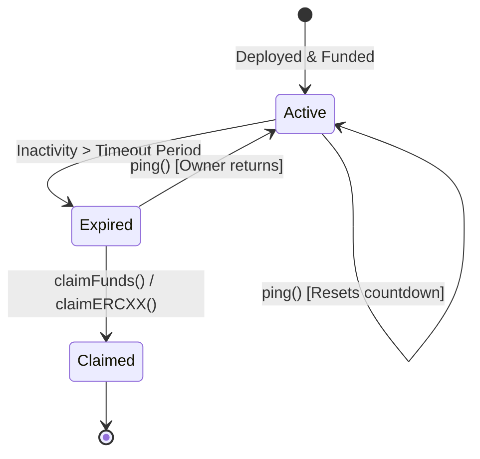

# LegacyForge ⚒️

[](https://opensource.org/licenses/MIT)
[](https://github.com/foundry-rs/foundry)
[]()

> A gas-optimized, non-custodial, and highly secure digital estate inheritance protocol built on the EVM.

LegacyForge provides an on-chain dead man's switch enabling trustless asset succession. By deploying an isolated vault, asset owners can deposit cryptocurrencies (ETH, ERC-20, ERC-721, and ERC-1155), set a custom inactivity timeout, and periodically register a proof-of-life ping. If the owner goes inactive past the configured threshold, a pre-designated beneficiary can trustlessly claim ownership of all assets.

No centralized custodians, no legal intermediaries, and no admin backdoors. Just immutable, self-executing code.

---

## Architecture & Design

LegacyForge uses a factory-cloned, non-upgradeable architecture to maximize security and guarantee self-sovereignty.

```
                      +-----------------------------+
                      |     LegacyForge Factory     |
                      |   (VaultFactory.sol)        |
                      +--------------+--------------+
                                     |
                                     |  createVault()
                                     v
                 +-------------------+-------------------+
                 |                                       |
                 v                                       v
      +----------+----------+                 +----------+----------+
      |  Owner A's Vault    |                 |  Owner B's Vault    |
      |  (Vault.sol Instance)                 |  (Vault.sol Instance)
      +----------+----------+                 +----------+----------+
                 |                                       |
                 +--> Deposit/Withdraw (ETH/ERC20/etc.)  +--> Deposit/Withdraw
                 +--> Ping (Proof-of-Life)               +--> Ping
                 +--> Beneficiary Inheritance Claim      +--> Beneficiary Inheritance Claim
```

### Key Architectural Pillars

*   **Isolated Vaults:** Instead of a single master pool contract representing a single point of failure, LegacyForge deploys a dedicated, isolated smart contract clone for every user. Any exploit or local state corruption is strictly contained to that individual vault.
*   **Zero Administrative Privilege:** Deployed vaults are owned strictly by their creator. The factory registry acts solely as a deployer and cataloger, retaining no management keys, upgrade capabilities, or access to assets.
*   **Multi-Token Support:** Designed for complete financial succession. Each vault natively manages and isolates:
    *   Native Ether (ETH)
    *   Fungible Tokens (ERC-20)
    *   Non-Fungible Tokens (ERC-721)
    *   Multi-Token Standards (ERC-1155)
*   **Collaborative Guardian Protection:** Supports a multi-guardian architecture. Guardians can register pings to prevent premature liquidations or assist in verifying claims without taking custody of funds.
*   **Gas Efficiency:** Deployed via minimal bytecode patterns and optimized memory utilization, making deployments and state maintenance highly cost-effective on Ethereum Mainnet and Layer-2 rollups.

---

## Smart Contract Specification

### LegacyForge Factory (`VaultFactory.sol`)
Acts as the global singleton deployment hub and indexing register. It tracks:
*   `ownerToVaults`: Mapping from owner address to their deployed vaults.
*   `beneficiaryToVaults`: Mapping from beneficiary address to the vaults they are authorized to inherit.
*   `isVault`: Quick validation to check if a specific address is an authentic LegacyForge instance.

### Individual Vault (`Vault.sol`)
A self-contained state machine containing the time-lock and inheritance logic.

#### Core State Lifecycle:


---

## Contract Reference

### Core Functions

#### Vault Management (Owner Only)
*   `ping()`: Resets the inactivity timer to `block.timestamp`.
*   `withdraw(uint256 amount)`: Safely withdraws a specified amount of native ETH from the vault.
*   `withdrawERC20(address token, uint256 amount)`: Safely withdraws a specified amount of ERC-20 tokens.
*   `withdrawERC721(address token, uint256 tokenId)`: Safely withdraws an ERC-721 token.
*   `withdrawERC1155(address token, uint256 id, uint256 amount, bytes calldata data)`: Safely withdraws ERC-1155 assets.
*   `changeBeneficiary(address newBeneficiary)`: Proposes or updates the current inheritor.
*   `updateTimeout(uint256 newTimeout)`: Modifies the inactivity period threshold.
*   `addGuardian(address guardian)` / `removeGuardian(address guardian)`: Manages vault guardians.

#### Fallback Inheritance (Beneficiary Only)
*   `claimFunds()`: Transfers all native ETH to the beneficiary if `block.timestamp > lastPingTime + timeoutPeriod`.
*   `claimERC20(address token)`: Sweeps the entire balance of an ERC-20 token to the beneficiary after expiration.
*   `claimERC721(address token, uint256 tokenId)`: Sweeps a designated NFT to the beneficiary after expiration.
*   `claimERC1155(address token, uint256 id, uint256 amount, bytes calldata data)`: Sweeps a designated ERC-1155 balance after expiration.

---

## Getting Started (Foundry Setup)

The smart contracts are managed and tested using the **Foundry** toolchain.

### Prerequisites

Ensure you have Foundry installed. If not, run:
```bash
curl -L https://foundry.paradigm.xyz | bash
foundryup
```

### Installation

Clone the repository and install dependencies from the `contracts/` directory:
```bash
cd contracts
forge install
```

### Running Tests

Execute the comprehensive test suite (includes edge cases, reentrancy simulations, and time-warp validations):
```bash
forge test -vv
```

To run gas reports:
```bash
forge test --gas-report
```

---

## Local Deployment & Simulation

You can simulate the entire lifecycle locally using `anvil` and `cast`.

### 1. Start Local EVM Node
```bash
anvil
```

### 2. Deploy Factory
In another terminal, deploy the `VaultFactory` using the local development key:
```bash
export PRIVATE_KEY=0xac0974bec39a17e36ba4a6b4d238ff944bacb478cbed5efcae784d7bf4f2ff80
forge script script/Deploy.s.sol --broadcast --rpc-url http://127.0.0.1:8545
```

### 3. Simulating Inactivity & Claim (Time Warp)
Anvil allows you to warp the blockchain clock to test time-locked features.

```bash
# 1. Deposit funds and set a 30-day (2,592,000s) timeout in your vault
# 2. Fast-forward the local chain clock by 31 days:
cast rpc anvil_increaseTime 2678400 --rpc-url http://127.0.0.1:8545

# 3. Mine a block to enforce the time warp:
cast rpc anvil_mine --rpc-url http://127.0.0.1:8545

# 4. Now, the beneficiary's claim transaction will be accepted by the EVM!
```

---

## Security & Trust Model

*   **Non-Custodial & Immutable:** Vaults contain no admin keys or upgradability proxies. Once a vault is deployed, its rules are locked permanently into the EVM.
*   **Reentrancy Guard:** All external asset-transferring actions implement OpenZeppelin's `ReentrancyGuard` to prevent reentrant extraction attacks.
*   **Safe Token Standards:** Out-of-the-box support for non-standard token implementations using `SafeERC20`.
*   **No Oracle Dependencies:** Expiration timers rely strictly on the blockchain consensus timestamp (`block.timestamp`), removing third-party data manipulation vectors.

> **Disclaimer:** These smart contracts have not been formally audited by a third-party security firm. Use on mainnet networks at your own risk.

---

## License

This project is licensed under the [MIT License](LICENSE).
